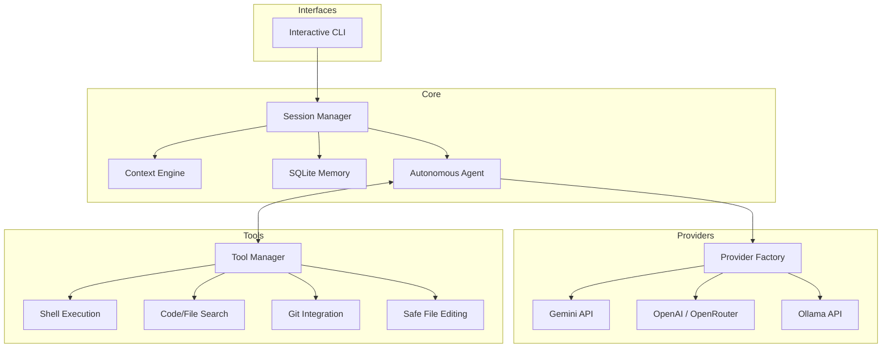

# Forge CLI

[](https://pypi.org/project/forge-cli/)
[](https://pypi.org/project/forge-cli/)
[](https://opensource.org/licenses/MIT)

Forge CLI is a next-generation, autonomous AI coding assistant that operates directly in your terminal. Built with Python and `uv`, it provides real-time pair programming, seamless code generation, and intelligent repository understanding without bloating your LLM context window.

## ✨ Features

- **🧠 Intelligent Context Engine:** Automatically scans your directory structure, reads your `README`, and checks Git status to inject highly relevant repository context before the LLM even answers a question.
- **🛠️ Robust Tool Ecosystem:** Powered by a unified `ToolManager` that parses schemas and catches runtime errors before they crash your session.
- **💻 Safe File Editing:** Uses a surgical `edit_file` tool to replace, insert, or delete specific blocks of code via precise string matching, eliminating the risk of whole-file overwrite truncation.
- **🔍 Blazing Fast Search:** Integrated `SearchTools` utilizing `ripgrep` for regex searches across your codebase with instant feedback (and a dependency-free Python fallback).
- **🌿 Git Integration:** Leverages `GitPython` to query repo history, branch status, diffs, and seamlessly track uncommitted changes.
- **🔌 Multi-Provider Support:** Plug in API keys for **Gemini, OpenAI, OpenRouter, and Ollama** for seamless model swapping.

## 🏗️ Architecture

The architecture is designed for modularity, safety, and continuous autonomous agent looping.



## 🚀 Installation

Ensure you have [uv](https://github.com/astral-sh/uv) installed, then run:

```bash
# Clone the repository
git clone https://github.com/Ayush0135/forge-cli.git
cd forge-cli

# Sync dependencies and install the CLI
uv sync
uv pip install -e .
```

### Configuration

You can configure Forge CLI via environment variables, a `.env` file, or via `~/.forge/config.json`.

```env
# .env
GEMINI_API_KEY=your_key_here
OPENAI_API_KEY=your_key_here
OPENROUTER_API_KEY=your_key_here
```

## 💡 Usage

Launch the interactive chat interface:
```bash
uv run forge chat
```

Or run a quick one-off prompt:
```bash
uv run forge "explain how the ContextEngine works in this repo"
```

## 🤝 Contributing
Contributions, issues, and feature requests are welcome!
See [CONTRIBUTING.md](CONTRIBUTING.md) for details.

## 📝 License
This project is licensed under the MIT License - see the [LICENSE](LICENSE) file for details.
