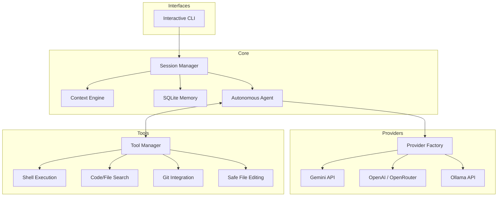

# Forge CLI Architecture

The architecture is highly modular, designed to support multiple AI providers, comprehensive tooling, and intelligent context injection.

## Flow Overview
1. **User Input:** Received via the interactive Typer/Rich CLI.
2. **Session Setup:** The `Session` retrieves history from `Memory` and builds a system prompt using the `ContextEngine` (which scans the project tree, git status, and README).
3. **Agent Loop:** The `Agent` queries the `ProviderFactory` and evaluates tool calls.
4. **Tool Execution:** When a model calls a tool, the `Agent` passes the request to the `ToolManager`, which validates and executes tools safely without crashing the agent.
5. **Observation:** Tool outputs are fed back to the model for continuous iteration.
